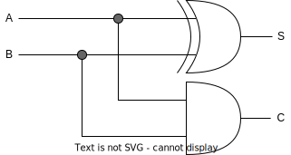

# CS

- - - - -

가산기
- 반가산기(half adder)
  - 이진수의 한자리수를 연산하고, 자리올림은 자리올림수(carry out) 출력으로 해서 2개의 입력과 2개의 출력을 갖는 회로입니다.
  - input : A, B / out : C, Sum
  - 

- 전가산기(full adder)
  - 이진수의 한자리수와 전의 입력에서 발생한 자리올림(carry)으로 3개의 입력과 2개의 출력을 갖는 회로 입니다.
  - input : A, B, Carry / out : C, Sum

- - - - -

감산기
  - 반감산기
    - 두 비트의 감산을 수행하는 조합 회로이며 결과를 D, 전 단계에서 1을 빌림수의 여부를 Br(borrow)로 출력하는 회로 입니다.
    - input : A, B / out : Br, Sum
  - 전감산기
    - 두 비트와 바로 전의 수행에서 빌려 준 1을 고려해 뺄셈을 수행하는 3개의 입력과 2개의 출력을 갖는 회로 입니다.
    - input : A, B, Br / out : Br, Sum

- - - - -

|게이트|기호|
|:---:|:---:|
|AND||
|OR||
|NOT||
|NAND||
|NOR||
|Buffer||
|XOR||
|XNOR||