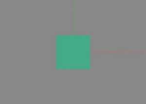

IMAGE REF : [https://threejs.org/manual/#en/fundamentals](https://threejs.org/manual/#en/fundamentals)   

- - - - -

```
const width = window.innerWidth;
const height = window.innerHeight;

const renderer = new THREE.WebGLRenderer();
renderer.setSize(width, height);
document.body.appendChild( renderer.domElement );
```

THREE.JS는 WebGLRenderer을 통해 화면에 보입니다

WebGLRenderer 객체에 생성자로 {canvas:HTMLCanvasElement}를 넘겨주거나   
빈 생성자로 WebGLRenderer 을 생성 후 domElement를 DOM에 추가해야 화면에 출력됩니다.

Scene 과 Camera 가 없는 상태에서는 검은 화면만 출력됩니다.

- - - - -

```
const scene = new THREE.Scene();
scene.background = new THREE.Color( 0xEEEEEE );

const width = window.innerWidth;
const height = window.innerHeight;

// fov — Camera frustum vertical field of view.
// aspect — Camera frustum aspect ratio.
// near — Camera frustum near plane.
// far — Camera frustum far plane.
const fov = 75;
const aspect = width / height;
const near = 0.1;
const far = 5;
const camera = new THREE.PerspectiveCamera(fov, aspect, near, far)

const renderer = new THREE.WebGLRenderer();
renderer.setSize(width, height);
document.body.appendChild( renderer.domElement );

renderer.render( scene, camera );
```

Scene 과 Camera를 추가합니다   
이때 Scene에 background를 지정하지 않을 경우 아직 아무것도 추가한 것이 없기 때문에 검은 화면만 출력되며 배경색을 지정할 경우 배경색만 출력됩니다.

- - - - -

```
const scene = new THREE.Scene();
scene.background = new THREE.Color( 0x888888 );

//x-axes : Red, y-axes : Green, z-axes : Blue
const axesHelper = new THREE.AxesHelper( 5 );
scene.add( axesHelper );

const geometry = new THREE.PlaneGeometry( 1, 1 );
const material = new THREE.MeshBasicMaterial({color: 0x44aa88});
const cube = new THREE.Mesh(geometry, material);
scene.add(cube);

const width = window.innerWidth;
const height = window.innerHeight;

// fov — Camera frustum vertical field of view.
// aspect — Camera frustum aspect ratio.
// near — Camera frustum near plane.
// far — Camera frustum far plane.
const fov = 75;
const aspect = width / height;
const near = 0.1;
const far = 5;
const camera = new THREE.PerspectiveCamera(fov, aspect, near, far)
camera.position.set(0, 0 ,2);
camera.rotation.set(0, 0, 0);

const renderer = new THREE.WebGLRenderer();
renderer.setSize(width, height);
document.body.appendChild( renderer.domElement );

renderer.render( scene, camera );
```

   
AxesHelper와 Mesh(PlaneGeometry, MeshBasicMaterial)를 추가한 다음   
z 축으로 2만큼 위에서 볼 경우 위 이미지처럼 출력됩니다.

AxesHelper는 중심(0,0,0)에 3축을 표시해 중심으로부터 위치, 각도를 확인할 수 있으며 PlaneGeometry는 단순한 평면 도형을 그릴 수 있습니다.   