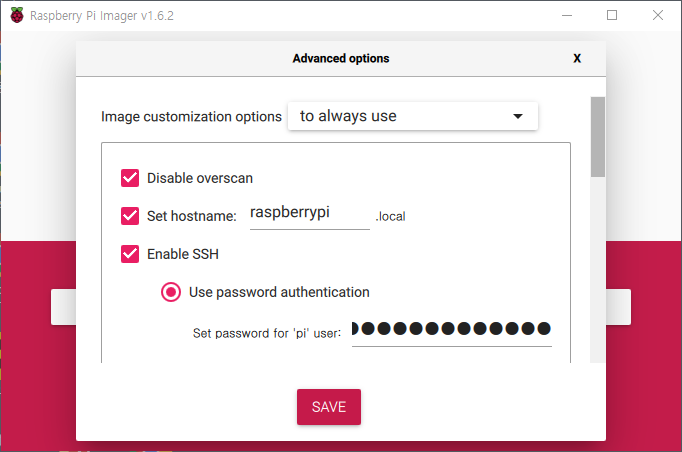

# Raspberry PI OS 설치하기

Raspberrry Pi 3 Model B+ 기준으로 작성되었습니다.

1\. Windows에 Raspberry PI Imager 설치하기 \([LINK](https://www.raspberrypi.com/software/)\)

- - - - -
2\. Operating System 에서는 설치할 OS 를 선택합니다.   
가볍게 Raspberry Pi OS Lite (32-bit) Released 2021-10-30 (0.5GB)를 선택했습니다.

Storage 에서는 설치할 SDCard를 선택합니다. SDCard가 포맷되기 때문에 잘 확인하고 선택하도록 합니다.   
(만약 이전에 다른 용도로 SDCard를 사용했다면 혹은 이미 한번 설치했다가 재설치를 한다면 따로 포맷용 툴을 설치할 필요 없이 Operating System 목록에서 ERASE를 선택 후 WRITE를 하면 됩니다)

- - - - -
3\. 키보드의 Ctrl + Shift + X 버튼으로 Advanced options를 볼 수 있습니다.
   

SSH를 활성화하고 비밀번호를 변경하거나 Wifi 연결 정보를 설정할 수 있습니다. Wifi 설정에서 Wifi country는 필요한 경우가 아니라면 GB에서 변경하지 않도록 합니다. (Wifi 연결이 안될수도 있습니다)

> Raspberry Pi Imager 없이 직접 구성한다면 참고 ( wpa_supplicant.conf / .ssh )
> https://www.raspberrypi.org/forums/viewtopic.php?t=199894
> https://www.raspberrypi.org/documentation/remote-access/ssh/README.md
> https://www.raspberrypi.org/documentation/configuration/wireless/wireless-cli.md
> https://www.raspberrypi.org/documentation/configuration/wireless/headless.md

- - - - -
4\. SAVE 및 WRITE를 하면 몇분정도 기다리도록 합니다. 최초 설치시에는 Writing... 0% 에서 시간이 더 소요될 수 있습니다.  Writing...   
(쓰기 작업 후 Verifying... 과정도 있습니다)    

※완료 (Write Successful) 표시될때 까지는 Cancel 혹은 SD card를 분리하지 않도록 합니다※

- - - - -
5\. SD card를 라즈베리파이에 넣고 전원을 입력합니다. (몇분 정도 대기합니다)

- - - - -
6\. 설정했던 SSH 계정 정보로 접속합니다 (IP주소는 공유기 설정에서 확인합니다)

Putty or Open SSH Client 설치 및 실행   
( 아이디 pi / 기본 비밀번호 raspberry )

> https://www.raspberrypi.org/documentation/linux/usage/users.md
> https://www.raspberrypi.org/documentation/remote-access/ssh/windows.md

- - - - -

7\. <u>sudo passwd root</u> 를 입력후 루트계정에 부여할 비밀번호를 입력 후 Enter, 재입력 후 Enter   
(passwd :password updated successfully) 를 확인하면 완료   
(Raspbery Pi Imager 가 아닌 다른툴로 직접 구성시 pi 비밀번호도 변경)   

> sudo raspi-config   
> 8 Update   
> 5 Localisation Options > Locale > ko_KR.EUC-KR , ko_KR.UTF-8 추가   
> 5 Locatisation Options > Timezone > Asia > Seoul   
> Finish > reboot now [Yes]

- - - - -

8\. 패키지 인덱스 정보 업데이트 및 패키지 업그레이드   
> sudo apt-get update -y   
> sudo apt-get upgrade -y   
> sudo reboot

- - - - -

라즈베리파이OS 에서 한글이 깨질경우   
> sudo apt-get install fonts-unfonts-core

위 방법으로 해결되지 않는 경우   
> sudo apt-get fonts-nanum fonts-nanum-extra